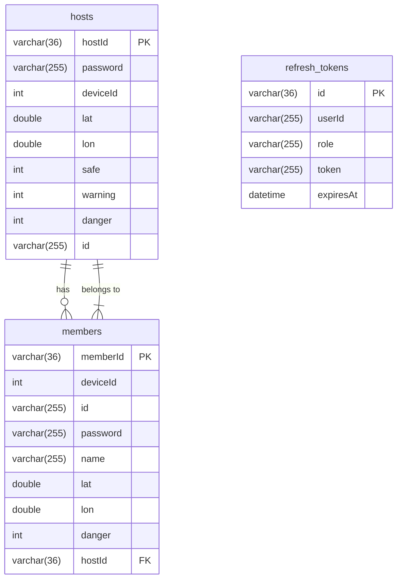

```mermaid
erDiagram

    hosts {
    varchar(36) hostId PK
    varchar(255) password
    int deviceId
    double lat
    double lon
    int safe
    int warning
    int danger
    varchar(255) id
    }

    members {
        varchar(36) memberId PK
        int deviceId
        varchar(255) id
        varchar(255) password
        varchar(255) name
        double lat
        double lon
        int danger
        varchar(36) hostId FK
    }

    refresh_tokens {
        varchar(36) id PK
        varchar(255) userId
        varchar(255) role
        varchar(255) token
        datetime expiresAt
    }

    hosts ||--o{ members : "has"
    members }|--|| hosts : "belongs to"
```